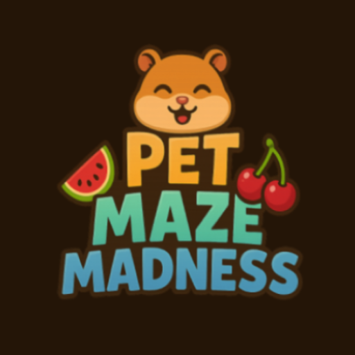
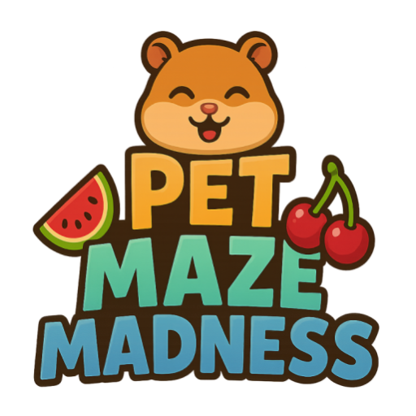
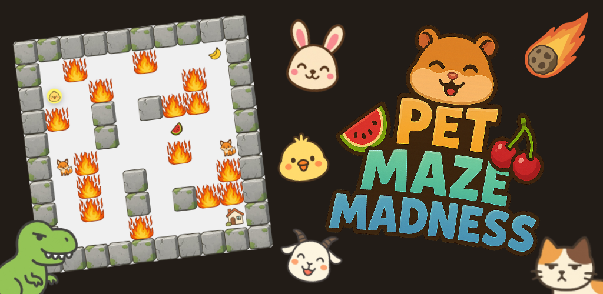
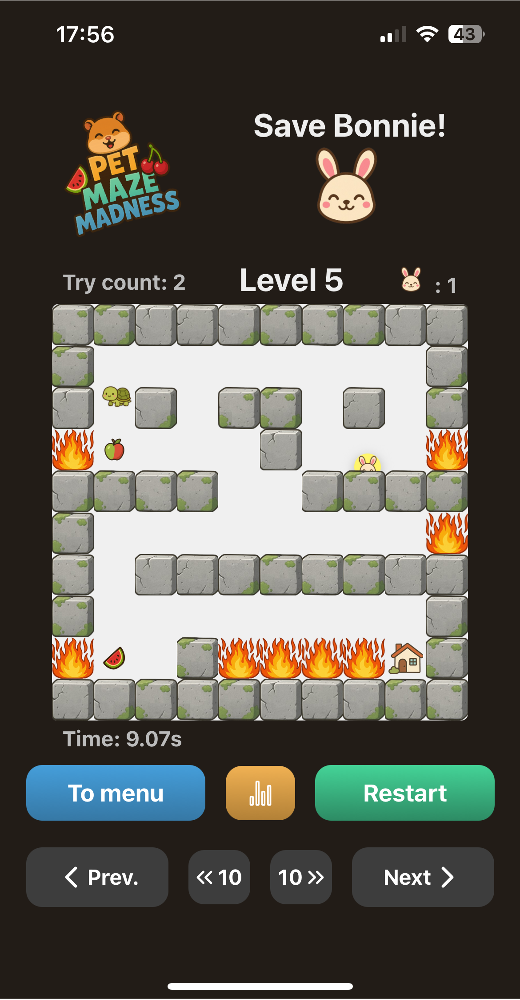
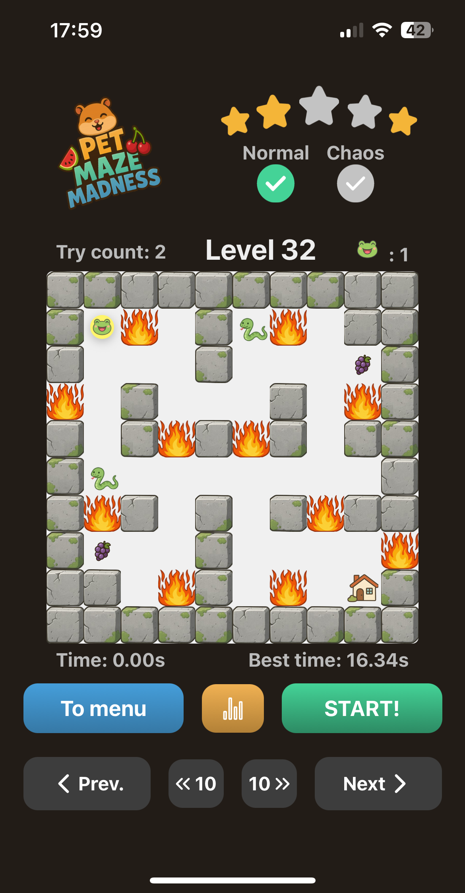
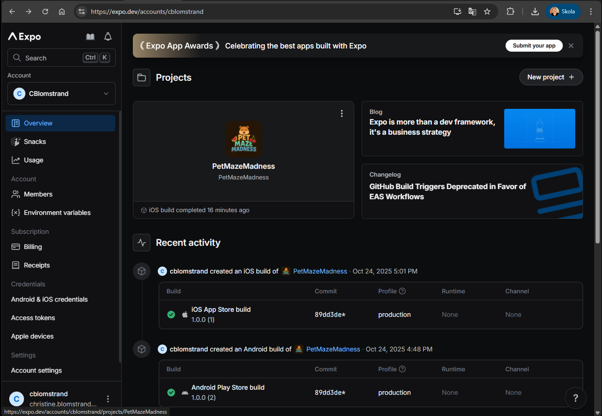

# Inlämningskrav för VG

## Inlämning

Lägg in den här filen i rooten av ditt projektet. Se sedan till att lägg till bilder och andra filer som behövs i projektet också och uppdatera länkarna nedan i det här dokumentet.

När du är klar zippar du ihop projektet (utan node_modules) och lämnar in inlämningen på nytt i Google Classroom.

**OBS: Öppna den här filen som preview så du ser att dina länkar är rätt. Om bilder inte visas så kommer VG kompletteringen inte att godkännas.**

## Förbered appen

Utöver det som ska anges i den här filen så ska du även lägga till en appikon och en splashscreen i [app.json](./app.json) filen samt eventuella andra inställningar om du har använt dig av exempelvis kameran eller GPS'en, den informationen finns dokumenterad för respektive modul i Expo referensen.

**Det här måste göras innan du bygger appen.**

## Skyltfönstret i butiken & Bygga appen.

Nu kan du bygga appen med EAS och ladda hem filen när den är klar. Fyll sedan i nedanstående uppgifter som bevis på att du bara är några få steg ifrån att lansera din applikation på butiken.

**Applikationens Namn:** 
Pet Maze Madness

**Kort Beskrivning (max 80):**
Help your pet avoid dangers and escape the maze to safety.
Find secret passageways or speedrun through mazes to collect all level stars.
Thrilling and fun for all ages!

**Fullständig Beskrivning (max 4000):**
A thrilling maze game for the whole family!

Tilt to survive! Guide your adorable pet through treacherous mazes using your device's motion sensors.
Move your device in ALL different directions guide the pet through the maze to avoid dangers, one wrong move and your pet faces a horrible fate.

Eat tasty fruits to gain extra lives and clear mazes more easily.
Find secret passageways and snacks, or speedrun through mazes to collect all level stars.

Different game modes:
NORMAL MODE - Tilt you device like a balance board to control the pet ball.
CHAOS MODE - Spin and twist with the gyroscope for a wild, activating challenge.

Physical device with gyroscope and accelerometer sensors required!

Applikationens ikon och laddningsbild.
;
;

En omslagsbild som visas på olika ställen i butiken.
;

Två till åtta fönsterbilder i formatet 16:9 eller 9:16 samt bredd och höjd mellan 320 och 3840 px.
;
;

[Binärfilen](./application-57c30e5c-970b-4560-aab9-1d40451c7287.aab);
;
Tänk på att bilden måste visa både "Created By" och "Start Time".
